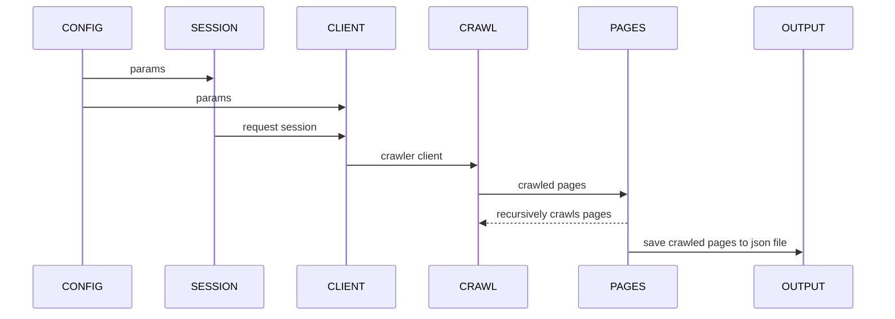

## Web Crawler
A basic web crawler for static web pages. Crawls pages and writes the result to a `.json` file in the project root. The json file name corresponds to the domain of the crawled pages.

## Sequence


## Dependencies
To run this application you need the following dependencies on your local machine:
- [Docker Desktop](https://www.docker.com/products/docker-desktop/). The docker daemon needs to be running.
- [Make](https://www.gnu.org/software/make/)

Validate you have both:
```sh
docker --version & make --version
```
If it fails, it means you're missing at least one dependency. Follow the appropriate link in the aforementioned dependencies to install.

## Run locally
This module exposes `crawl` (a method in `CrawlerClient`) which recursively crawls web links based on paramaters specified in the `config.yml`. The steps involved are shown in the sequence diagram above. You can crawl additional domains by adding the domain's params to the `domains` section in the `config.yml` file.

Run the web crawler thus: 
1. Start the application (in one terminal and leave the terminal open):
```sh
make start
```
2. In another terminal
```sh
make run
```

After starting the application you can run unit tests with:
```sh
make test
```

## Stop Application
Shut down the application and remove all outputed files and (docker) images/networks:
```sh
make stop
```